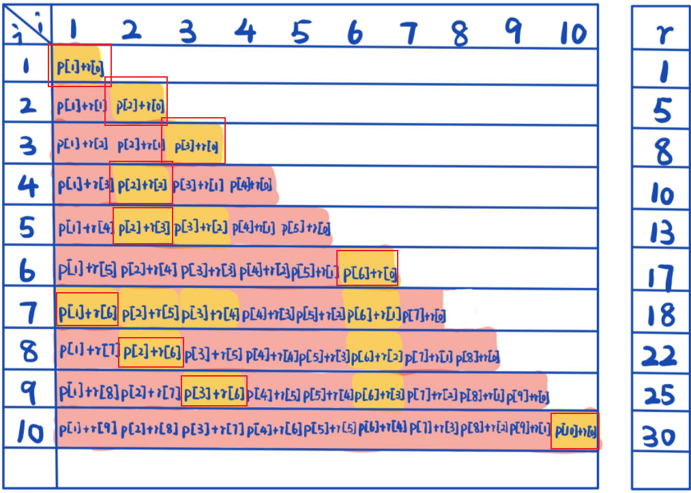

# 15 Dynamic Programming  

## 15.1 Rod cutting  

[cut_rod.cpp](./cut_rod.cpp)  
[cut_rod.hpp](./cut_rod.hpp)  

Usage:  
`g++ cut_rod.cpp` and `-DDEBUG` as optional.  
`./a.out <method>`  

Three methods are available:  
+ `naive`. The straightforward one to traverse recursively.  
+ `memoized`. The top-down dynamic programming.   
+ `bottomup`. The bottom-up dynamic programming.  
+ 

# 钢管切割问题

## 前情提要
给定一根定长的钢管，并给出一个价位表：


假如这根定长的钢管长为10，那么如何切割它才能得到最大的利润？


r代表钢管的总长度，以下为最大利润及对应的切割次数和方法：


我们可以得到公式：


$P_n
$ 代表不做任何切割，直接将原长度卖出。


## 递归地自顶向下实现


C++实现：

```C++
int
CutRod::naive(const std::vector<int>& p, const int n){
    if(n == 0)
        return 0;

    int q = INT_MIN; 
    for(int i = 1; i <= n; ++i)
        q = std::max(q, p[i]+naive(p, n-i));
    return q;
}
```
然而由于递归会做大量重复计算，该算法的复杂度为$O（2^n)
$ 

从4开始自顶向下地递归，我们会发现：


当n为4时，参与实际计算的算子一共有8 + 4 + 2 + 1 + 1 = 16，刚好为$2^n
$ ,所以我们之前对复杂度的估计是没有错的。

我们也可以将n设为5：


但实际上只有最左路通路的计算是有效的，其他的计算都是重复计算，浪费了大量CPU算力。


当n很小时，这个复杂度看上去似乎也没多少。

但一旦n变成30左右的数时，我们会发现计算机就已经计算得非常缓慢了：

```C++
for(int i = 0; i < 100; i++)
        std::cout << i << ":\t" << CutRod::calculate(p, i, m) << std::endl;
```


可能要经过好一阵子才发现计算又多出了一格：


## 动态规划-记忆化自顶向下
如果我们能够在计算某值时检查之前是否已经计算过它，那么我们就可以避免大量无用计算：


在后续的计算中，我们都将其重定向到最左侧通路的计算结果。


伪代码：


与之前不同的是，我们此处加入了递归检查。如果之前已经有过计算(即$r[n]>=0$），那么就直接返回，而不用经历下面的那个循环。这里大大降低了递归函数的复杂度。

C++ 实现：

```C++
int 
CutRod::memoized(const std::vector<int>& p, const int n){
    std::vector<int> r(n+1, INT_MIN);
    return memoizedAux(p, n, r);
}  

int 
CutRod::memoizedAux(const std::vector<int>& p, const int n, std::vector<int>& r){
    if(r[n]>=0)
        return r[n];

    int q = 0;
    if(n != 0){
        q == INT_MIN;
    
        for(int i = 1; i <= n; ++i)
            q = std::max(q, p[i] + memoizedAux(p, n-i, r));
    }
    r[n] = q;
    return q;
}
```


一秒钟就计算出了结果。

**仍然友情提醒：我们此处并为对长度10以上的数定义价格，所以此处计算出的值是没有意义的**。

**但是计算速度的大幅提升，确实体现了动态规划的威力**。


因为我们引入了一个记录用的数组r，每次在计算前先检查一遍这个r里面有没有存储之前计算过的结果。如果有，直接沿用即可。

## 动态规划-递推式自顶向上
因为实际计算都发生在最左侧通路，而且我们之前的思路是从n一直到0自顶向下计算，实际上我们也可以从0一直追溯到递归根节点，通过一种自底向上的方法计算，优势在于空间复杂度进一步缩小，没有递归函数调用栈的开销：


C++实现：

```C++
int 
CutRod::bottomUp(const std::vector<int>& p, const int n){
    std::vector<int> r;
    r.reserve(n+1);
    r[0] = 0;
    for(int j = 1; j<=n; ++j){
        int q = INT_MIN;
        for(int i = 1; i<=j; ++i)
            q = std::max(q, p[i]+r[j-i]);//参考前文公式，逐个比对
        r[j] = q;//保存子问题答案
    }
    return r[n];
}
```
轨迹图其实与自顶向下无异，中间往下的通路即为原图的最左侧通路：


自顶向上，从1开始一步一步计算出剩余的最优方案，即r数组：

黄色区域即为当钢管长为j时最优的切割方案，r数组即对应的最优值。


注意，最优的切割方案并不唯一，所以存在多个黄色区域值相等。

通过此表我们也能轻易发现复杂度已经变成了$O(n^2)$ ,相比之前不带记忆化的自顶向下递归$O(2^n)$ 已经好了不少。

## 打印出具体的切割方案
我们只是知道最大的利润（what），但有时我们想知道如何得到这个最大的利润（how）。

伪代码：


C++实现：

```C++
int 
CutRod::bottomUp(const std::vector<int>& p, const int n){
    std::vector<int> r, s;
    s.reserve(n+1);
    r.reserve(n+1);
    r[0] = 0;
    for(int j = 1; j<=n; ++j){
        int q = INT_MIN;
        for(int i = 1; i<=j; ++i)
            if(q < p[i]+r[j-i]){
                q = p[i] + r[j-i];
                s[j] = i;
            }
 
        r[j] = q;
    return r[n];
}
```


我们放弃了用简单的max函数来比较q和最大利润，转而采用了if语句来完成这件事，于此同时我们引入了一个s数组，当对应的值真正大于q时，保存第一个出现的最佳方案：


你会发现，s数组里保存的数据，正是：



没错，就是这些最佳方案中的第一个的下标。

所以我们想打印这条轨迹，只需再从已有的结果中自顶向下回溯即可：

伪代码：


C++实现：

```C++
int temp = n;
while(temp > 0){
    std::cout << s[temp] << " ";
    temp = temp - s[temp];
}
std::cout << std::endl;
```
通过观察前10个元素的结果，我们会发现和课本上的结果是吻合的，只不过我们此处只输出了第一个符合要求的结果：

  


